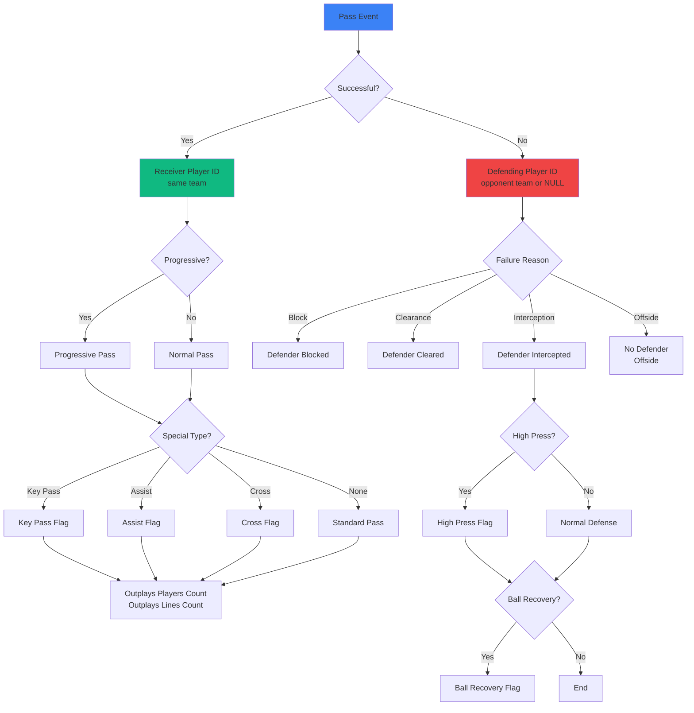
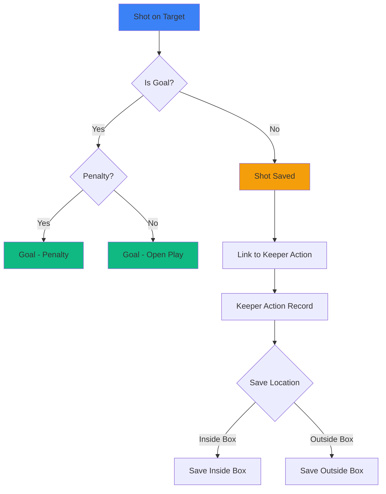
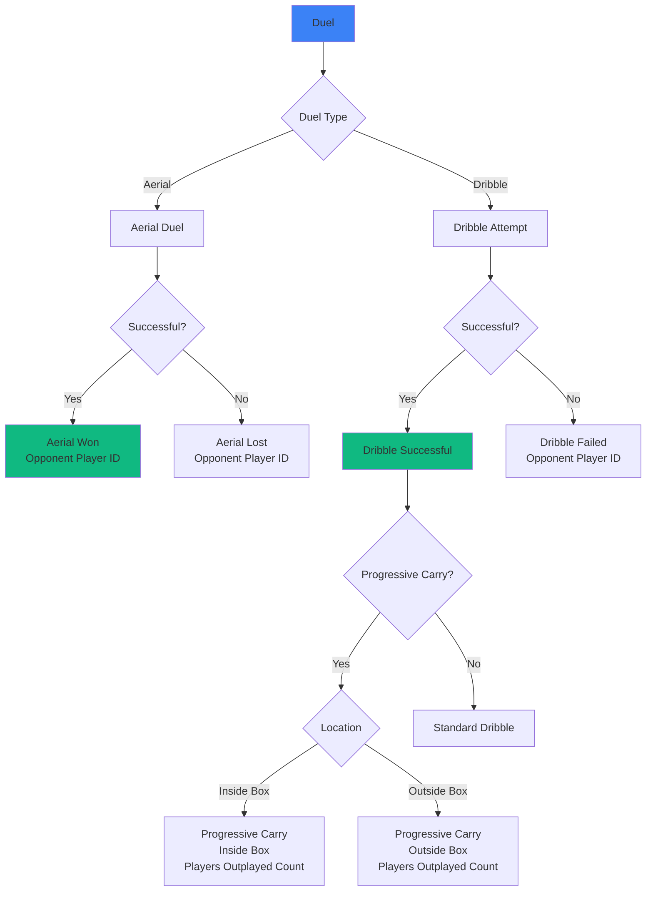
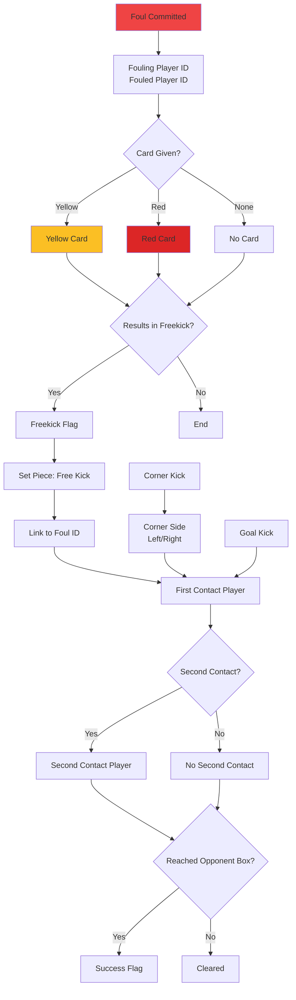
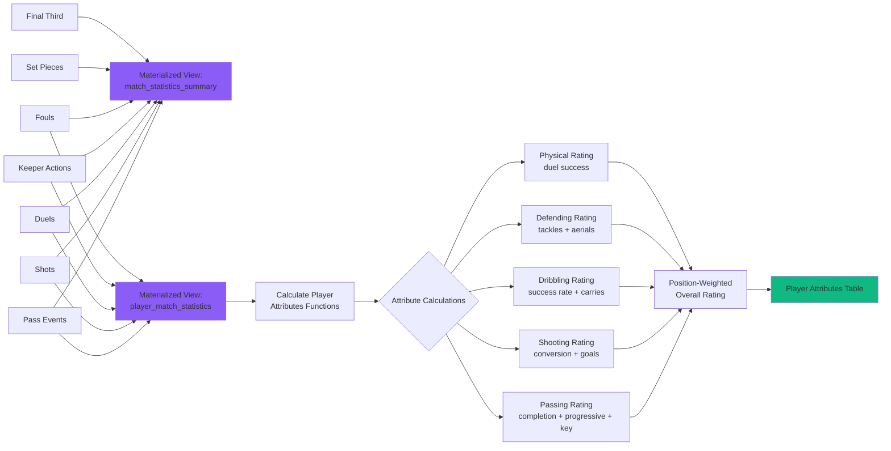
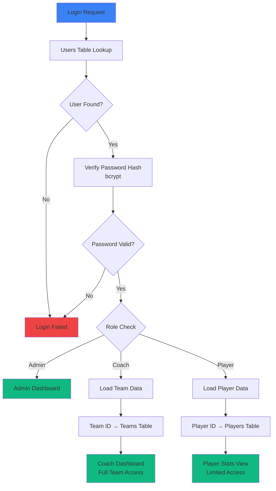
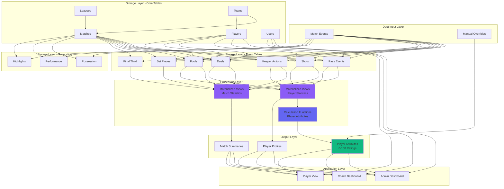
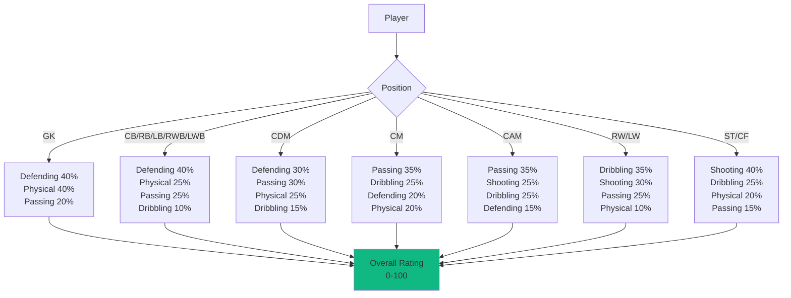

# Complete Database Flow & Structure

This document contains comprehensive Mermaid diagrams visualizing the entire database architecture, relationships, and data flows.

---

## 1. Entity Relationship Diagram (Complete Schema)

```mermaid
erDiagram
    leagues ||--o{ team_leagues : "contains"
    teams ||--o{ team_leagues : "participates"
    teams ||--o{ players : "has"
    teams ||--o{ matches : "home_team"
    teams ||--o{ matches : "away_team"
    teams ||--o{ matches : "our_team"
    teams ||--o{ users : "employs"
    
    players ||--o{ player_attributes : "has"
    players ||--o{ pass_events : "passes"
    players ||--o{ pass_events : "receives"
    players ||--o{ pass_events : "defends"
    players ||--o{ shots_on_target : "shoots"
    players ||--o{ keeper_actions : "performs"
    players ||--o{ duels : "challenges"
    players ||--o{ duels : "opposes"
    players ||--o{ fouls : "commits"
    players ||--o{ fouls : "fouled"
    players ||--o{ set_pieces : "first_contact"
    players ||--o{ set_pieces : "second_contact"
    players ||--o{ users : "linked_to"
    
    matches ||--o{ pass_events : "contains"
    matches ||--o{ shots_on_target : "contains"
    matches ||--o{ keeper_actions : "contains"
    matches ||--o{ duels : "contains"
    matches ||--o{ fouls : "contains"
    matches ||--o{ set_pieces : "contains"
    matches ||--o{ final_third_chances : "contains"
    matches ||--o{ match_possession : "tracks"
    matches ||--o{ match_performance : "tracks"
    matches ||--o{ match_highlights : "contains"
    
    fouls ||--o{ set_pieces : "results_in"
    keeper_actions ||--o{ shots_on_target : "saves"
    pass_events ||--o{ final_third_chances : "creates"
    
    leagues {
        uuid id PK
        text league_name
        int tier
        text country
        text league_type
    }
    
    teams {
        uuid id PK
        text team_name
        text head_coach_name
        text logo_url
        bool has_free_access
    }
    
    team_leagues {
        uuid id PK
        uuid team_id FK
        uuid league_id FK
        bool is_primary
    }
    
    players {
        uuid id PK
        uuid team_id FK
        text first_name
        text last_name
        int jersey_number
        text position
        date date_of_birth
    }
    
    player_attributes {
        uuid id PK
        uuid player_id FK
        int passing
        int shooting
        int dribbling
        int defending
        int physical
        int overall_rating
        bool is_manual
    }
    
    matches {
        uuid id PK
        uuid home_team_id FK
        uuid away_team_id FK
        uuid our_team_id FK
        uuid league_id FK
        date match_date
        int home_score
        int away_score
    }
    
    users {
        uuid id PK
        text email
        text password_hash
        text role
        text first_name
        text last_name
        uuid team_id FK
        uuid player_id FK
    }
    
    pass_events {
        uuid id PK
        uuid match_id FK
        uuid player_id FK
        uuid receiver_player_id FK
        uuid defending_player_id FK
        bool is_successful
        bool is_progressive_pass
        bool is_key_pass
        bool is_assist
    }
    
    shots_on_target {
        uuid id PK
        uuid match_id FK
        uuid player_id FK
        uuid keeper_action_id FK
        bool is_goal
        bool is_penalty
        bool is_saved
    }
    
    keeper_actions {
        uuid id PK
        uuid match_id FK
        uuid player_id FK
        text action_type
        text save_location
    }
    
    duels {
        uuid id PK
        uuid match_id FK
        uuid player_id FK
        uuid opponent_player_id FK
        text duel_type
        bool is_successful
        bool is_progressive_carry
    }
    
    fouls {
        uuid id PK
        uuid match_id FK
        uuid fouling_player_id FK
        uuid fouled_player_id FK
        text card_given
        bool resulted_in_freekick
    }
    
    set_pieces {
        uuid id PK
        uuid match_id FK
        uuid foul_id FK
        uuid first_contact_player_id FK
        uuid second_contact_player_id FK
        text set_piece_type
        bool reached_opponent_box
    }
    
    final_third_chances {
        uuid id PK
        uuid match_id FK
        uuid related_pass_event_id FK
        bool is_in_box
        bool is_corner
    }
    
    match_possession {
        uuid id PK
        uuid match_id FK
        int minute
        int our_team_possession
        int opponent_possession
    }
    
    match_performance {
        uuid id PK
        uuid match_id FK
        int minute
        int our_team_rating
        int opponent_rating
    }
    
    match_highlights {
        uuid id PK
        uuid match_id FK
        int minute
        text event_type
        text description
    }
```

---

## 2. Pass Events Flow

---

## 3. Shot Events Flow

---

## 4. Duel Events Flow

---

## 5. Foul & Set Piece Flow

---

## 6. Data Processing Flow (Events → Statistics)

---

## 7. User Authentication Flow

---

## 8. Complete System Architecture

---

## 9. Position-Based Rating Weights

---

## Summary

This database uses an **event-driven architecture** where:

1. **Individual events** (passes, shots, duels, fouls) are stored with complete context
2. **Materialized views** aggregate events into match and player statistics
3. **Calculation functions** derive player skill ratings from performance
4. **Position-aware algorithms** ensure realistic player ratings
5. **User authentication** enables role-based access (admin/coach/player)

**Key Benefits:**
- ✅ Infinitely scalable - add new stats by querying existing events
- ✅ No schema changes needed for new metrics
- ✅ 10-20x faster queries with materialized views
- ✅ Auto-calculated player ratings
- ✅ Complete audit trail of all match events
