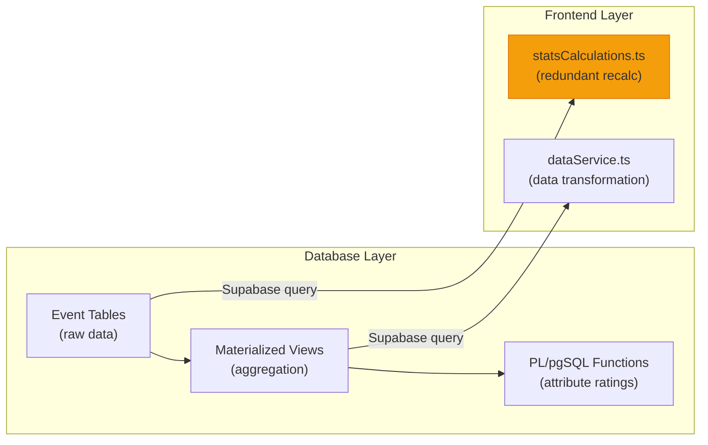

# Player Analytics — Comprehensive Project Analysis

---

## 1. Files Recommended for Deletion

### 🔴 Redundant / Superseded SQL Files in `new_database/extras/`

These files are **old iterations** of the materialized views that have been superseded by `database_updates_stats_structure.sql`. They contain stale view definitions and are no longer needed:

| File | Reason |
|------|--------|
| [view-update-part1.sql](file:///c:/Users/divya/Desktop/player-analytics/new_database/extras/view-update-part1.sql) | Superseded — old partial view update |
| [view-update-part2.sql](file:///c:/Users/divya/Desktop/player-analytics/new_database/extras/view-update-part2.sql) | Superseded — intermediate view iteration |
| [view-update-part3.sql](file:///c:/Users/divya/Desktop/player-analytics/new_database/extras/view-update-part3.sql) | Superseded — intermediate view iteration |
| [view-recalibrated.sql](file:///c:/Users/divya/Desktop/player-analytics/new_database/extras/view-recalibrated.sql) | Superseded — old recalibrated views |
| [view-final.sql](file:///c:/Users/divya/Desktop/player-analytics/new_database/extras/view-final.sql) | Superseded — "final" views now in `database_updates_stats_structure.sql` |
| [update-view-with-indices.sql](file:///c:/Users/divya/Desktop/player-analytics/new_database/extras/update-view-with-indices.sql) | Superseded — indices now in the consolidated migration |

### 🔴 Redundant Root-Level Documentation

| File | Reason |
|------|--------|
| [database_structure_now.txt](file:///c:/Users/divya/Desktop/player-analytics/database_structure_now.txt) | Duplicate of schema — `new_sql_strucure.txt` is newer and identical in purpose |
| [database_explanation.txt](file:///c:/Users/divya/Desktop/player-analytics/database_explanation.txt) | 41-line file superseded by `DATABASE.md` which covers materialized views + auto-refresh in much more detail |
| [prompt.txt](file:///c:/Users/divya/Desktop/player-analytics/prompt.txt) | 3-line feature request note — should be tracked in an issue tracker, not committed |

### 🟡 Files to Review (Keep/Delete Decision Needed)

| File | Notes |
|------|-------|
| [new_sql_strucure.txt](file:///c:/Users/divya/Desktop/player-analytics/new_database/new_sql_strucure.txt) | Raw schema dump — useful as quick reference but duplicates the `.sql` files. Consider keeping as a snapshot or regenerating on demand |
| [stats-calculations.txt](file:///c:/Users/divya/Desktop/player-analytics/new_database/stats-calculations.txt) | Identical content to `extras/calculate-player-attributes.sql` + `database-player-attributes-calculation.sql`. One of them should be deleted |
| [auto_refresh_triggers.sql](file:///c:/Users/divya/Desktop/player-analytics/new_database/auto_refresh_triggers.sql) | Duplicate of `extras/auto-refresh-triggers.sql` — only one should exist |
| [database-automatic-refresh.sql](file:///c:/Users/divya/Desktop/player-analytics/new_database/database-automatic-refresh.sql) | Another auto-refresh variant — likely superseded by `auto_refresh_triggers.sql` |

### 🟢 Active / Required Files (DO NOT DELETE)

**Schema (core):**
- `database-schema-part1.sql`, `database-schema-part2.sql`, `database-schema-part3.sql`
- `database-schema-users.sql`
- `database_updates_stats_structure.sql` (the latest migration with new tables + updated views)
- `database-drop-all.sql`

**Extras (active):**
- `extras/refresh-views.sql`, `extras/calculate-player-attributes.sql`
- `extras/auto-refresh-triggers.sql`
- `extras/add-failed-events.sql`

**Seed Data:**
- `seed/master-seed.sql` + all numbered seed files
- `complete_seed_data/` (all 4 match event files + master loader)

**Documentation:**
- `DATABASE.md`, `FULL_FLOW.md`, `README.md`, `seed/README.md`, `complete_seed_data/README.md`
- `stats_structure.md` (root) — essential event schema reference

---

## 2. Complete Database Table & Column Inventory

### Core Tables

#### `leagues`
| Column | Type | Notes |
|--------|------|-------|
| id | uuid PK | |
| league_name | text | |
| tier | integer (1-5) | |
| custom_label | text | nullable |
| is_default | boolean | |
| country, state, district | text | geographic info |
| league_type | text | `professional`, `youth`, `friendly`, `other` |
| created_at, updated_at | timestamptz | |

> **Frontend**: Fetched via `getMatches()` → `match.league_id`. Used for filtering/grouping.

---

#### `teams`
| Column | Type | Notes |
|--------|------|-------|
| id | uuid PK | |
| team_name | text | |
| team_email | text | unique |
| user_id | uuid FK → auth.users | nullable |
| head_coach_name | text | |
| logo_url | text | |
| has_free_access | boolean | |
| is_onboarded | boolean | |
| metadata | jsonb | |
| created_at, updated_at | timestamptz | |

> **Frontend**: `getTeams()` fetches all. Used in match context, player listings, sidebar.

---

#### `players`
| Column | Type | Notes |
|--------|------|-------|
| id | uuid PK | |
| team_id | uuid FK → teams | |
| first_name | text | |
| last_name | text | nullable |
| jersey_number | integer (1-99) | |
| position | text | `GK`, `CB`, `RB`, `LB`, `RWB`, `LWB`, `CM`, `CDM`, `CAM`, `RW`, `LW`, `ST`, `CF` |
| date_of_birth | date | |
| nationality | text | |
| created_at, updated_at | timestamptz | |

> **Frontend**: `getPlayers()` fetches all. Mapped to `Player` type via `dataService.ts`. Position converted by `dbPositionToFrontend()`.

---

#### `player_attributes`
| Column | Type | Notes |
|--------|------|-------|
| id | uuid PK | |
| player_id | uuid FK → players | unique |
| passing, shooting, dribbling, defending, physical | integer (0-100) | skill ratings |
| overall_rating | integer (0-100) | position-weighted |
| is_manual | boolean | coach override flag |
| last_calculated_at | timestamptz | |
| created_at, updated_at | timestamptz | |

> **Frontend**: `getPlayerAttributes()` fetches all. Mapped to `PlayerAttributes` type. Displayed on player profile cards (radar chart).

---

#### `matches`
| Column | Type | Notes |
|--------|------|-------|
| id | uuid PK | |
| home_team_id, away_team_id, our_team_id | uuid FK → teams | |
| league_id | uuid FK → leagues | nullable |
| competition_name | text | |
| match_date | date | |
| home_score, away_score | integer | |
| home_jersey_color, away_jersey_color | varchar | |
| video_url | text | |
| created_by | uuid FK → auth.users | |
| created_at, updated_at | timestamptz | |

> **Frontend**: `getMatches()` fetches all with team joins. Used in match listing, match detail pages.

---

### Event Tables

#### `pass_events`
| Column | Type | Notes |
|--------|------|-------|
| id | uuid PK | |
| match_id | uuid FK → matches | |
| team_id | uuid FK → teams | |
| player_id | uuid FK → players | passer |
| minute, second | integer | time of event |
| start_x, start_y, end_x, end_y | real (0-100) | coordinates |
| is_successful | boolean | |
| receiver_player_id | uuid FK → players | nullable — on success |
| is_key_pass, is_progressive_pass, is_cross, is_assist | boolean | flags |
| outplays_players_count, outplays_lines_count | integer | |
| assist_pass_type, cross_pass_type | text | `normal`, `key`, `progressive` |
| defending_player_id | uuid FK → players | nullable — on failure |
| failure_reason | text | `block`, `clearance`, `interception`, `offside`, `ball_collection`, `unsuccessful_cross`, `tackle` |
| failure_subtype | text | `tackle`, `unsuccessful_cross`, `ball_collection` |
| is_high_press, is_ball_recovery | boolean | |
| pass_length | text | `short`, `long` (added by migration) |
| ball_recovery_result | text | `successful`, `unsuccessful` (added by migration) |
| video_time_sec | real | (added by migration) |
| formatted_time | text | (added by migration) |
| created_at | timestamptz | |

> **Frontend**: `getPassEvents()` fetches by match+team. Used in passing maps, passing tree, synergy analysis. Converted via `passEventToMatchEvent()`.

---

#### `shots_on_target`
| Column | Type | Notes |
|--------|------|-------|
| id | uuid PK | |
| match_id, team_id, player_id | uuid FKs | |
| minute, second | integer | |
| shot_x, shot_y | real (0-100) | origin |
| shot_end_x, shot_end_y | real (0-100) | landing point (added by migration) |
| is_goal | boolean | |
| is_penalty | boolean | |
| is_saved | boolean | |
| shot_result | text | `goal`, `saved`, `off_target` (added by migration) |
| save_location | text | `inside_box`, `outside_box` (added by migration) |
| shot_opponent_id | uuid FK → players | goalkeeper (added by migration) |
| keeper_action_id | uuid FK → keeper_actions | (original schema) |
| video_time_sec | real | (added by migration) |
| formatted_time | text | (added by migration) |
| created_at | timestamptz | |

> **Frontend**: `getShots()` fetches by match+team. Converted via `shotEventToMatchEvent()`.

---

#### `keeper_actions`
| Column | Type | Notes |
|--------|------|-------|
| id | uuid PK | |
| match_id, team_id, player_id | uuid FKs | |
| minute, second | integer | |
| action_x, action_y | real (0-100) | |
| action_type | text | `save`, `collection`, `goal_conceded` |
| save_location | text | `inside_box`, `outside_box` |
| video_time_sec | real | (added by migration) |
| formatted_time | text | (added by migration) |
| created_at | timestamptz | |

> **Frontend**: Not directly fetched individually, but aggregated via `player_match_statistics` view.

---

#### `duels`
| Column | Type | Notes |
|--------|------|-------|
| id | uuid PK | |
| match_id, team_id, player_id | uuid FKs | |
| minute, second | integer | |
| duel_x, duel_y | real (0-100) | |
| duel_type | text | `aerial`, `dribble` |
| is_successful | boolean | |
| duel_outcome | text | `won`, `lost`, `successful`, `unsuccessful` (added by migration) |
| opponent_player_id | uuid FK → players | |
| is_progressive_carry | boolean | |
| progressive_carry_location | text | `inside_box`, `outside_box` |
| players_outplayed_count | integer | |
| video_time_sec | real | (added by migration) |
| formatted_time | text | (added by migration) |
| created_at | timestamptz | |

> **Frontend**: `getDuels()` fetches by match+team. Converted via `duelToMatchEvent()`.

---

#### `fouls`
| Column | Type | Notes |
|--------|------|-------|
| id | uuid PK | |
| match_id | uuid FK | |
| fouling_team_id, fouling_player_id | uuid FKs | who committed |
| fouled_team_id, fouled_player_id | uuid FKs | who was fouled |
| minute, second | integer | |
| foul_x, foul_y | real (0-100) | |
| card_given | text | `yellow`, `red`, `none` |
| resulted_in_freekick | boolean | |
| created_at | timestamptz | |

> **Frontend**: Not fetched directly — aggregated via materialized views.

---

#### `final_third_chances`
| Column | Type | Notes |
|--------|------|-------|
| id | uuid PK | |
| match_id, team_id, player_id | uuid FKs | |
| minute, second | integer | |
| chance_x, chance_y | real (0-100) | |
| is_in_box | boolean | |
| is_corner | boolean | |
| corner_type | text | `short`, `long` |
| long_corner_success | boolean | |
| chance_side | text | `left`, `right`, `centre` (renamed from `corner_side` by migration) |
| location_in_box | text | `left`, `centre`, `right` |
| related_pass_event_id | uuid FK → pass_events | |
| chance_receiver_id | uuid FK → players | (added by migration) |
| chance_sub_type | text | `corner`, `normal` (added by migration) |
| video_time_sec | real | (added by migration) |
| formatted_time | text | (added by migration) |
| created_at | timestamptz | |

> **Frontend**: Not fetched directly — aggregated via materialized views.

---

#### `set_pieces`
| Column | Type | Notes |
|--------|------|-------|
| id | uuid PK | |
| match_id, team_id, player_id | uuid FKs | |
| minute, second | integer | |
| set_piece_x, set_piece_y | real (0-100) | |
| set_piece_type | text | `goal_kick`, `free_kick`, `corner`, `throw_in` |
| first_contact_made | boolean | |
| first_contact_player_id | uuid FK | |
| second_contact_made | boolean | |
| second_contact_player_id | uuid FK | |
| reached_opponent_box | boolean | |
| corner_side | text | `left`, `right` |
| foul_id | uuid FK → fouls | link to triggering foul |
| set_piece_card | text | `yellow`, `red`, `none` (added by migration) |
| opponent_player_id | uuid FK → players | (added by migration) |
| video_time_sec | real | (added by migration) |
| formatted_time | text | (added by migration) |
| created_at | timestamptz | |

> **Frontend**: Not fetched directly — aggregated via materialized views.

---

### Supporting Tables

| Table | Purpose | Frontend Use |
|-------|---------|--------------|
| `match_possession` | Minute-by-minute possession % (home/away) | Possession chart on match page |
| `match_performance` | Minute-by-minute performance ratings (home/away) | Performance chart on match page |
| `match_highlights` | Key match moments (type + description) | Match timeline |
| `match_video_notes` | Timestamped notes for match videos | Video analysis page |
| `match_analytical_maps` | URLs for heatmap/touchmap images | Analytical overlay views |
| `match_captured_frames` | Annotated video frame captures | Frame analysis page |
| `frame_cache` | Cached video frame image URLs | Internal performance |
| `knowledge` | User-uploaded content (files, text) | Knowledge base feature |
| `team_profile` | Team onboarding profile | Onboarding flow |
| `player_interviews` | Match interview headings and scores | Interview review page |
| `player_interview_notes` | Timestamped notes on interviews | Interview notes |
| `schema_baseline` | Schema migration tracking | Internal — not frontend-facing |

### New Tables (from migration)

| Table | Purpose | Frontend Use |
|-------|---------|--------------|
| `player_heatmaps` | Per-player per-match heatmap image URLs | Player heatmap display on match stats page |
| `physical_stats` | Distance, sprints, high-intensity runs | Player physical stats tab |

---

## 3. Materialized Views

### `match_statistics_summary`

Aggregates **team-level** stats per match (home vs away). Contains ~80 columns covering:

| Category | Home Columns | Away Columns |
|----------|-------------|-------------|
| Passing | successful, unsuccessful, total, progressive, key, assists, crosses, long, short | Same |
| Defensive | interceptions, blocks, clearances, ball_recoveries, high_press_recoveries | Same |
| Shots | shots_on_target, goals, penalties, shots_saved, shots_off_target | Same |
| Duels | aerial_duels_won/total, successful/total_dribbles, progressive_carries | Same |
| Goalkeeper | saves, saves_inside/outside_box, goals_conceded | Same |
| Fouls | fouls_committed, yellow_cards, red_cards | Same |
| Set Pieces | corners, freekicks, throw_ins | Same |
| Chances | final_third_entries, chances_in_box | Same |

> **Frontend**: `getMatchStatistics()` fetches this. Used for the match overview comparison bars.

### `player_match_statistics`

Aggregates **player-level** stats per match. Contains ~45 columns:

- Passing: successful/unsuccessful/total passes, progressive, key, assists, crosses, outplayed, long/short
- Defensive: interceptions, blocks, clearances, ball_recoveries, high_press_actions
- Shooting: shots_on_target, goals, penalties_scored, shots_off_target
- Duels: aerial_duels_won/total, successful/total_dribbles, progressive_carries, outplayed_dribbling
- Goalkeeper: saves, saves_inside/outside_box, goals_conceded, ball_collections
- Fouls: fouls_committed, fouls_won, yellow_cards, red_cards
- Set Pieces: corners_taken, freekicks_taken
- Final Third: final_third_touches
- Physical: distance_covered_meters, sprint_count, high_intensity_runs

> **Frontend**: `getPlayerMatchStatistics()` fetches this. Used for per-player match breakdowns.

---

## 4. Calculation Logic — Database vs Frontend

### Where Calculations Happen



### Database Calculation Functions

| Function | Source Data | Formula | Output |
|----------|-----------|---------|--------|
| `calculate_passing_rating()` | `player_match_statistics` | 40% completion + 25% progressive + 20% key passes + 15% assists | 0-100 |
| `calculate_shooting_rating()` | `player_match_statistics` | 50% conversion + 30% goals + 20% shot frequency | 0-100 |
| `calculate_dribbling_rating()` | `player_match_statistics` | 60% success rate + 40% progressive carries | 0-100 |
| `calculate_defending_rating()` | `player_match_statistics` | 50% actions (interceptions+blocks+clearances) + 50% aerial win % | 0-100 |
| `calculate_physical_rating()` | `player_match_statistics` | 100% duel success rate (proxy) | 0-100 |
| `calculate_overall_rating()` | All above ratings | Position-weighted average (see DATABASE.md) | 0-100 |

### Frontend Calculation Functions (in `statsCalculations.ts`)

> [!WARNING]
> These frontend calculations **duplicate** what the database materialized views already provide. They fetch raw event data and re-aggregate.

| Function | What It Does | Redundant? |
|----------|-------------|-----------|
| `calculatePassStats()` | Counts passes, computes accuracy, key passes, etc. | ⚠️ **Yes** — `player_match_statistics` view already has all these |
| `calculatePassesInFinalThird()` | Filters passes by `start_x > 66.67` | ⚠️ **Partially** — not in materialized view, but could be added |
| `calculatePassesInBox()` | Filters passes by penalty box coordinates | ⚠️ **Partially** — not in materialized view, but could be added |
| `calculateShotStats()` | Counts shots, goals, conversion rate | ⚠️ **Yes** — duplicates view |
| `calculateDuelStats()` | Counts aerial/dribble duels, success rates | ⚠️ **Yes** — duplicates view |
| `calculateKeeperStats()` | Counts saves, collections by location | ⚠️ **Yes** — duplicates view |
| `calculateChanceStats()` | Counts chances, corners, box entries | ⚠️ **Yes** — duplicates view |

### Frontend `buildMatchStats()` (in `dataService.ts`)

This function constructs the `MatchStats` object. Several fields are hardcoded to `null`:

```typescript
// These fields return null despite being available in player_match_statistics:
blocks: null,        // ← Available as interceptions, blocks, clearances in view
interceptions: null, // ← Available in view
clearances: null,    // ← Available in view
recoveries: null,    // ← Available as ball_recoveries in view
tackles: null,       // ← Not tracked separately (part of duels)
progressiveRuns: null,    // ← Available as progressive_carries in view
distanceCovered: null,    // ← Available in physical_stats table
sprints: null,            // ← Available as sprint_count in physical_stats table
```

---

## 5. Code Quality Findings & Cleaning Steps

### 🔴 Critical Issues

1. **Redundant Frontend Calculations**: `statsCalculations.ts` re-computes stats from raw events that are already aggregated in the `player_match_statistics` materialized view. This doubles API calls and processing time.
   - **Fix**: Use `getPlayerMatchStatistics()` directly and map view fields to `MatchStats` type instead of fetching raw events + re-calculating.

2. **Null Fields in `buildMatchStats()`**: 8 fields in the `MatchStats` interface return `null` even though the data exists in the database views/tables.
   - **Fix**: Map `interceptions`, `blocks`, `clearances`, `ball_recoveries`, `progressive_carries` from `player_match_statistics`. Map `distance_covered_meters`, `sprint_count` from `physical_stats`.

3. **`toFrontendMatchStats()` Claims Data is Unavailable**: Lines 397-405 in `statsCalculations.ts` explicitly state "Not available in database — return null" for blocks, interceptions, clearances, recoveries. **This is incorrect** — these are in the updated materialized view.
   - **Fix**: Update comments and fetch from the view.

### 🟡 Medium Issues

4. **Inconsistent Type Definitions**: `database.types.ts` has `keeper_actions.action_type` as `'save' | 'collection'` but the actual DB schema includes `'goal_conceded'`. The type is missing it.
   - **Fix**: Add `'goal_conceded'` to the union type.

5. **`MatchStats` Interface Doesn't Cover All View Fields**: The `MatchStats` type in `player.ts` is missing several fields that exist in the DB view:
   - Missing: `long_passes`, `short_passes`, `fouls_committed`, `fouls_won`, `corners_taken`, `freekicks_taken`, `final_third_touches`, `penalties_scored`, `shots_off_target`, `ball_collections`, `high_press_actions`, `total_players_outplayed_passing`, `total_lines_outplayed`, `total_players_outplayed_dribbling`
   - **Fix**: Extend `MatchStats` interface or create a new comprehensive type.

6. **Duplicate Auto-Refresh Script Files**: Multiple versions of auto-refresh triggers exist across:
   - `new_database/auto_refresh_triggers.sql`
   - `new_database/database-automatic-refresh.sql`
   - `new_database/extras/auto-refresh-triggers.sql`
   - **Fix**: Consolidate to one canonical file, delete the rest.

7. **Duplicate Stats Calculation Files**:
   - `new_database/stats-calculations.txt`
   - `new_database/database-player-attributes-calculation.sql`
   - `new_database/extras/calculate-player-attributes.sql`
   - **Fix**: Keep only `extras/calculate-player-attributes.sql` (the one in the documented workflow).

### 🟢 Minor Issues

8. **No Automated Tests**: Zero unit tests or integration tests exist in the project. The `statsCalculations.ts` utility functions are pure functions ideal for unit testing.
   - **Recommendation**: Add vitest or jest tests for calculation utilities.

9. **`statsDefinitions.ts` (757 lines)**: Large file with hardcoded stat definitions. While functional, it could be split by category or auto-generated from DB schema.

10. **`prompt.txt` at Root**: Contains a feature request note. Should be in an issue tracker, not a committed file.

---

## 6. Consolidated Database Structure Summary

### Architecture Overview

```
┌─────────────────────────────────────────────────────────────┐
│                    APPLICATION LAYER                         │
│  React + TypeScript + Supabase Client                       │
│  dataService.ts → fetches from Supabase                     │
│  statsCalculations.ts → frontend calculations (redundant)   │
└──────────────────────┬──────────────────────────────────────┘
                       │ Supabase JS Client
┌──────────────────────▼──────────────────────────────────────┐
│                    SUPABASE / POSTGRES                       │
│                                                             │
│  ┌─────────────┐  ┌─────────────┐  ┌──────────────────┐    │
│  │  Core Tables │  │Event Tables │  │ Supporting Tables │    │
│  │  • leagues   │  │• pass_events│  │ • match_possession│   │
│  │  • teams     │  │• shots      │  │ • match_perform. │    │
│  │  • players   │  │• keeper_act.│  │ • match_highlights│   │
│  │  • matches   │  │• duels      │  │ • video_notes    │    │
│  │  • player_   │  │• fouls      │  │ • analytical_maps│    │
│  │    attributes│  │• set_pieces │  │ • captured_frames│    │
│  └──────┬──────┘  │• final_third│  │ • player_heatmaps│    │
│         │         └──────┬──────┘  │ • physical_stats │    │
│         │                │         │ • knowledge      │    │
│         │                │         │ • team_profile   │    │
│         │                ▼         │ • interviews     │    │
│         │  ┌──────────────────┐    └──────────────────┘    │
│         │  │ Materialized Views│                            │
│         │  │ • match_stats_   │                            │
│         │  │   summary        │                            │
│         │  │ • player_match_  │                            │
│         │  │   statistics     │                            │
│         │  └────────┬─────────┘                            │
│         │           │                                      │
│         │           ▼                                      │
│         │  ┌──────────────────┐                            │
│         │  │ PL/pgSQL Functions│                            │
│         └──►• calculate_*_    │                            │
│            │  rating()        │                            │
│            │• update_player_  │                            │
│            │  attributes()    │                            │
│            └──────────────────┘                            │
│                                                             │
│  ┌──────────────────┐                                      │
│  │  Automation       │                                      │
│  │  • Triggers on    │                                      │
│  │    event tables   │                                      │
│  │  • refresh_queue  │                                      │
│  │  • debounced view │                                      │
│  │    refresh        │                                      │
│  └──────────────────┘                                      │
└─────────────────────────────────────────────────────────────┘
```

### Table Count Summary

| Category | Count | Tables |
|----------|-------|--------|
| Core | 5 | leagues, teams, players, player_attributes, matches |
| Event | 7 | pass_events, shots_on_target, keeper_actions, duels, fouls, set_pieces, final_third_chances |
| Supporting | 10 | match_possession, match_performance, match_highlights, match_video_notes, match_analytical_maps, match_captured_frames, frame_cache, knowledge, team_profile, player_interviews |
| Supporting (sub) | 2 | player_interview_notes, schema_baseline |
| New (migration) | 2 | player_heatmaps, physical_stats |
| Junction | 1 | team_leagues |
| Materialized Views | 2 | match_statistics_summary, player_match_statistics |
| **Total** | **29 tables + 2 views** | |

### Data Flow

1. **Raw events** are inserted into the 7 event tables via the frontend data entry UI
2. **Database triggers** detect changes and queue a debounced materialized view refresh
3. **Materialized views** (`match_statistics_summary`, `player_match_statistics`) aggregate all event data
4. **PL/pgSQL functions** compute player attribute ratings (0-100) from the aggregated view data
5. **Frontend** fetches from views and core tables via Supabase, with some redundant re-calculation in `statsCalculations.ts`
